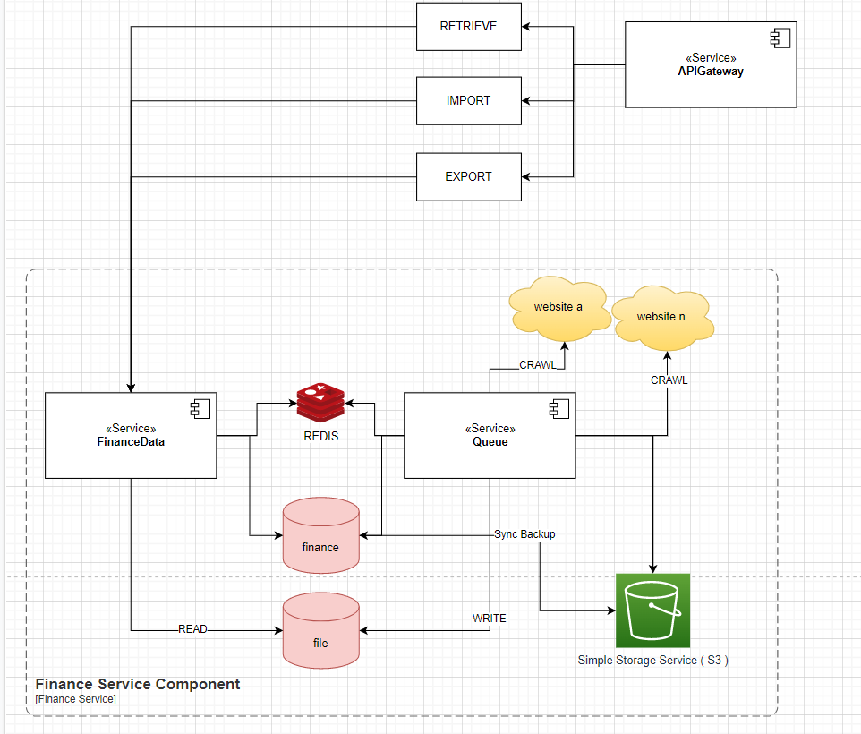

# API

> Overview Architecture



## Stack

> Database + ORM

- Database: MongoDB
- ORM: Mongoose

> Client-Server

- HTTP REST API
- JWT Token

> Background Jobs

- [BullMQ](https://docs.bullmq.io/)
- [Bull Dashboard](https://github.com/felixmosh/bull-board)

> Cron

- [Repeatable Job](https://docs.bullmq.io/guide/jobs/repeatable)

> Test

- [JestJS](https://jestjs.io/docs/tutorial-async)

> Log

- [Log4js](https://www.npmjs.com/package/log4js)
- [Sentry](https://sentry.io/)

> Document

- [Gitbook](https://www.gitbook.com/)

> Monitoring tools

- [Prometheus]
- [Prom Client](https://www.npmjs.com/package/prom-client)
- [Grafana](https://grafana.com/oss/prometheus/exporters/nodejs-exporter/?tab=installation#introduction)

> Devops

- [Devopscube](https://devopscube.com/)

> Third party tools

- [Mailjet](https://app.mailjet.com/dashboard)
- [S3]

## Setup

```bash
cp .env.sample .env
# replace with your environment's values
# start database
docker-compose up -d
```

## Jest

- [JEST CLI](https://jestjs.io/docs/cli)

## How to run test

> How to run a specific file ?

```bash
npx jest ./test/class-validator-with-schema.spec.ts
```
